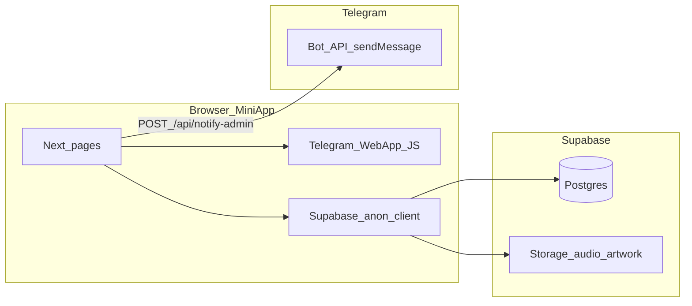

# Что у вас есть в проекте tg-mini-app

Подробный обзор репозитория: продукт, стек, экраны, данные Supabase, интеграция с Telegram, API и известные пробелы по безопасности/документации.

## Продукт и назначение

- **Telegram Mini App** для загрузки музыкальных релизов в дистрибуцию (брендинг в UI/metadata: «omf mini app», README: «Telegram Release Uploader»).
- **Язык интерфейса:** русский (`lang="ru"` в `app/layout.tsx`).
- **Корневой маршрут `/`** и устаревший **`/dashboard`** делают **редирект на `/library`** (`app/page.tsx`, `app/dashboard/page.tsx`) — основной экран «Мои релизы».

## Технологический стек

| Слой | Технологии |
|------|-------------|
| Фреймворк | Next.js **14.1**, App Router |
| UI | React 18, **TailwindCSS**, **Framer Motion**, кастомные «glass» компоненты (`components/GlassCard.tsx`, `components/NoiseOverlay.tsx`) |
| Формы / валидация | **react-hook-form**, **zod** (@hookform/resolvers) |
| Состояние черновика релиза | **zustand** + persist (`features/release/createRelease/store.ts`) |
| Бэкенд данных | **Supabase** (`@supabase/supabase-js`), клиент в браузере: `lib/supabase.ts` с `NEXT_PUBLIC_SUPABASE_URL` и `NEXT_PUBLIC_SUPABASE_ANON_KEY` |
| Уведомления UI | **sonner** (тосты в layout) |
| Кэш / списки | **SWR** — см. `AppProviders`, страницы `/library` и `/admin` |
| Иконки | **lucide-react** |

## Структура приложения (экраны и навигация)

- Нижняя навигация: `components/BottomNav.tsx` — **Мои релизы** (`/library`), **Кошелек** (`/wallet`), **Настройки** (`/settings`). Пункт **Админ** (`/admin`) показывается только если `getTelegramUserId() === getExpectedAdminTelegramId()` (проверка на клиенте).
- **Основные страницы:**
  - **Мои релизы** (`/library`) — полный список релизов из Supabase, **SWR** (`swr`) с интервальной ревалидацией и глобальным `SWRConfig` в `components/AppProviders.tsx` (`revalidateOnFocus: false`, `dedupingInterval: 5000`), статистика по статусам (Готово/Проверка/Ошибки), черновики и ошибки с действиями как раньше на отдельном Dashboard, переход к созданию.
  - **Поток создания релиза** — под `/create/...`: метаданные, треки, обложка/файлы, ревью; после успешной отправки — переход на **`/library`**; логика в `features/release/` + `repositories/releases.repo.ts`.
  - **Деталь релиза** — `/release/[id]`.
  - **Кошелек** — `/wallet`: UI с условными суммами (оценка по «готовым» релизам, минимальный вывод и т.д. — см. константы в файле).
  - **Настройки** — `/settings`: в основном **статичные** пункты без реального переключения настроек.
  - **Онбординг** — `/onboarding`.
  - **Админ** — `/admin`: очередь модерации через **SWR** (как `/library`), действия модерации (привязка к `user_id` админа на клиенте). **Кошелёк** (`/wallet`) по-прежнему использует `lib/useSafePolling.ts`.

## Данные и доменная модель (по коду)

- **Статусы релиза** (`lib/db-enums.ts`): `draft`, `processing`, `ready`, `failed`.
- **Типы релиза:** `single`, `ep`, `album`.
- **Таблицы**, с которыми работает клиент:
  - `releases` — поля в том числе: `user_id`, `client_request_id` (идемпотентность через upsert по конфликту), `artist_name`, `track_name`, `release_type`, `genre`, `release_date`, `explicit`, `audio_url`, `artwork_url`, `status`, `error_message`, опционально `isrc`, `authors`, `splits`, `created_at`.
  - `release_tracks` — треки мульти-релиза (`release_id`, `index`, `title`, `explicit`, `audio_url`), upsert по `(release_id, index)`.
  - `release_logs` — логирование этапов (`release_id`, `stage`, `status`, `error_message`).
- **Storage Supabase:** бакеты **`audio`** и **`artwork`** (пути в `lib/storagePaths.ts`); загрузки и удаления — в `repositories/releases.repo.ts` (WAV, лимиты размера, JPG/PNG для обложки).
- **RPC:** при сабмите вызывается `finalize_release` с фолбэком на простое обновление статуса, если функции нет (`repositories/releases.repo.ts`, `submitRelease`).

**Чеклист для облачного Supabase (прод):** миграция `supabase/migrations/20250320120000_finalize_release_transaction.sql` должна быть применена; в SQL Editor проверьте наличие функции `finalize_release` и что для роли **`anon`** есть **`GRANT EXECUTE`** на эту функцию (иначе клиент не сможет финализировать релиз и сработает только фолбэк при доступных правах на `UPDATE`).

**Важно:** корневой `README.md` ранее мог описывать упрощённую схему. **Фактическая реализация в коде** — отдельные бакеты `audio`/`artwork`, треки, логи. Опирайтесь на этот документ, `repositories/releases.repo.ts` и SQL в Supabase.

## Интеграция с Telegram

- Подключён скрипт Telegram Web App JS в `app/layout.tsx`.
- `components/TelegramBootstrap.tsx` + `lib/telegram.ts`: `initTelegramWebApp()` — `ready`, `expand`, цвета, запись cookie `tg_init_data` из `initData` (для возможного серверного использования).
- Идентификация пользователя в UI/запросах — **`initDataUnsafe.user.id`** (`getTelegramUserId()`), не криптографическая граница безопасности.
- **Серверная проверка подписи** реализована в `lib/telegram-init-data.server.ts` (`verifyTelegramInitData`); для **API Route Handlers** используется обёртка `withTelegramAuth` в `lib/api/with-telegram-auth.ts` (извлечение initData из `X-Telegram-Init-Data` или cookie `tg_init_data` через `getTelegramInitDataFromRequest`). Пример: `POST /api/notify-admin`.

## Админ и переменные окружения

- `lib/admin.ts`: `ADMIN_TELEGRAM_ID` из env, иначе **захардкоженный fallback** — важно задать env в проде.
- `.env.local.example`: `NEXT_PUBLIC_SUPABASE_*`, `SUPABASE_SERVICE_ROLE_KEY`, `ADMIN_TELEGRAM_ID`, `TELEGRAM_BOT_TOKEN`, `ADMIN_CHAT_ID`.
- **Логи ошибок UI:** `lib/logger.ts` в production шлёт POST на [`app/api/client-error/route.ts`](app/api/client-error/route.ts). При наличии `SUPABASE_SERVICE_ROLE_KEY` строки пишутся в таблицу **`error_logs`** (миграция `supabase/migrations/20260321120000_error_logs.sql`). Без service role ошибки только в server `console.error`.

## API и уведомления

- **Next.js Route Handler:** `app/api/notify-admin/route.ts` — POST, **защищён SSV** (`withTelegramAuth`): требуется валидный `initData` и `TELEGRAM_BOT_TOKEN` на сервере; иначе **401**. Тело — поля метаданных релиза, отправка админу через **Telegram Bot API** (`sendMessage`). При отсутствии токена/чата для отправки после успешной авторизации возвращает `ok: false`, но со статусом **200** (чтобы не ломать клиент тихо).
- **Supabase Edge Function:** `supabase/functions/notify-admin/index.ts` — альтернативный путь уведомлений из бэкенда Supabase.
- **SQL-триггер (опционально):** `supabase/sql/notify-admin-webhook.sql` — вызов HTTP к Edge Function при INSERT в `releases` (нужна ручная подстановка URL и JWT).

## Документированные риски и «хвосты**

Из `README.md` (разделы Security / Required server-side follow-up):

- Клиентские guardrails **не** являются границей безопасности.
- Нужны: **middleware/API** для админки, **rate limit** для `/api/notify-admin`, **RLS** в Supabase для разделения прав чтения/записи. Верификация `initData` на защищённых **API** роутах — через `withTelegramAuth` (см. README).

## Визуальная архитектура (упрощённо)

## Куда развивать дальше

Точечные направления улучшений: **безопасность**, **схема БД/README**, **UX потока создания**, **кошелёк/платежи**, **админка**, **наблюдаемость**.
