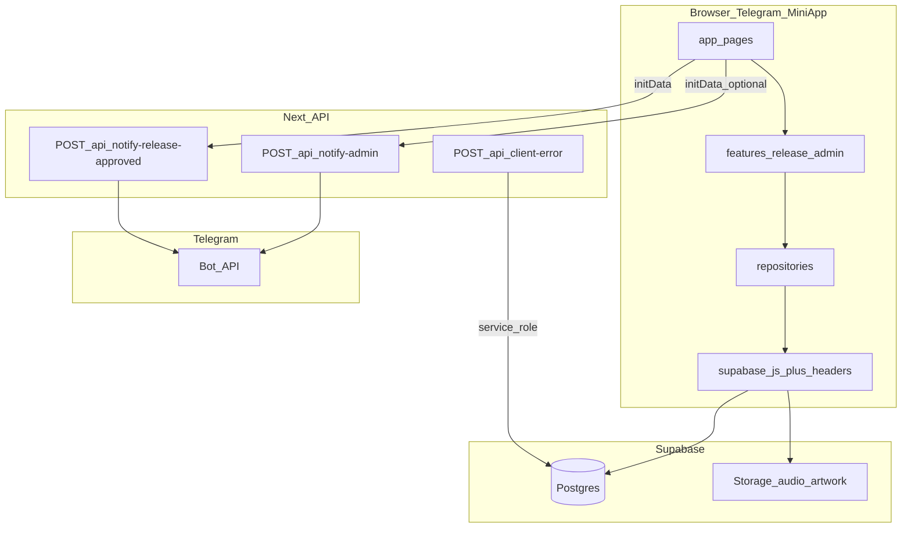

# Architecture Manifest — tg-mini-app

Документ описывает текущее состояние репозитория: стек, организацию кода, UX/performance-паттерны, бизнес-потоки, безопасность, схему данных Supabase и направления развития. Язык интерфейса приложения — русский (`lang="ru"` в [`app/layout.tsx`](../app/layout.tsx)).

---

## 1. Обзор архитектуры

### 1.1 Технологический стек

| Слой | Технологии |
|------|------------|
| Фреймворк | **Next.js 14.1** (App Router) — см. [`package.json`](../package.json) |
| UI | React 18, **Tailwind CSS**, **Framer Motion**, `lucide-react` |
| Формы / валидация | **react-hook-form**, **zod** (@hookform/resolvers) |
| Черновик мастера создания релиза | **zustand** + persist — [`features/release/createRelease/store.ts`](../features/release/createRelease/store.ts) |
| Данные | **Supabase** (`@supabase/supabase-js`), клиент [`lib/supabase.ts`](../lib/supabase.ts) |
| Кэш списков | **SWR** — глобальный `SWRConfig` в [`components/AppProviders.tsx`](../components/AppProviders.tsx) |
| Telegram | Скрипт `telegram-web-app.js` в [`app/layout.tsx`](../app/layout.tsx), обёртки [`lib/telegram.ts`](../lib/telegram.ts), bootstrap [`components/TelegramBootstrap.tsx`](../components/TelegramBootstrap.tsx) |
| Ошибки UI | **react-error-boundary**, **sonner** (тосты) |
| Прочее | canvas-confetti (успех), кастомные glass-компоненты |

**Примечание:** отдельной папки `api/` в корне нет — HTTP-обработчики лежат в **`app/api/*/route.ts`** (стандарт Next.js App Router).

### 1.2 Структура папок и обоснование

| Путь | Назначение |
|------|------------|
| **`app/`** | Маршруты App Router: страницы (`page.tsx`), вложенные `layout.tsx`, границы ошибок (`error.tsx`, `global-error.tsx`), **API routes** в `app/api/`. Централизует маршрутизацию и серверные обработчики рядом с UI. |
| **`components/`** | Переиспользуемые UI-блоки приложения: навигация, glass-карточки, плеер, скелетоны, провайдеры. Не привязаны к одному фиче-домену. |
| **`features/`** | Вертикальные срезы по домену: **`features/release/createRelease/`** (store, схемы, server actions для черновика), **`features/admin/actions.ts`** (модерация). Снижает связность с «общими» компонентами. |
| **`lib/`** | Утилиты и инфраструктура: Supabase-клиент, Telegram (клиент/сервер), логирование, константы шагов мастера, статусы релиза, обёртки API-авторизации. |
| **`hooks/`** | Клиентские хуки с чёткой зоной ответственности (например, умный скролл — [`hooks/useScrollDirection.ts`](../hooks/useScrollDirection.ts)). |
| **`repositories/`** | Доступ к данным Supabase (таблицы, Storage, RPC) — [`repositories/releases.repo.ts`](../repositories/releases.repo.ts). Единая точка для запросов и загрузок файлов. |
| **`types/`** | Декларации типов (например, `canvas-confetti`). |
| **`supabase/`** | Миграции SQL, Edge Function `notify-admin`, вспомогательные SQL для webhook. |

Такая раскладка отделяет **маршруты** (`app`), **доменную логику фич** (`features`), **данные** (`repositories` + `lib/supabase`) и **общий UI** (`components`).

---

## 2. Технические решения (Performance & UX)

### 2.1 «Умный скролл» и скрытие `BottomNav`

Реализация: [`hooks/useScrollDirection.ts`](../hooks/useScrollDirection.ts) + [`components/BottomNav.tsx`](../components/BottomNav.tsx).

- **Логика:** отслеживается `scrollTop` документа (`window`). При прокрутке **вниз** на величину больше порога (`threshold`, по умолчанию 16px) нижняя панель скрывается; при прокрутке **вверх** — показывается. У верхней границы (`scrollTop ≤ 8px`) панель всегда видна. Если контент не скроллится, панель остаётся видимой.
- **`passive: true`** для `scroll` и **`touchmove` на `document`:** снижает блокировку главного потока и улучшает отзывчивость на тач-устройствах (в т.ч. Telegram WebView).
- **Троттлинг ~75 ms** + **trailing timeout:** не обрабатывать каждый кадр скролла, но гарантировать финальный проход после серии быстрых событий.
- **`requestAnimationFrame`:** фактическое сравнение `delta` и обновление состояния выполняется в одном кадре (`scheduleRun` → `runScrollLogic`), что уменьшает лишние ре-рендеры.
- **`ResizeObserver` на `documentElement`:** если высота контента меняется и скролл исчезает, панель снова показывается.
- **Исключение:** на [`/create/success`](../app/create/success/page.tsx) скрытие отключено (`scrollHideEnabled = pathname !== "/create/success"`), чтобы навигация не пряталась на финальном экране.
- **Анимация:** Framer Motion (`animate={{ y: navVisible ? 0 : "115%" }}`); внешний `nav` без transform по горизонтали, чтобы не конфликтовать с центрированием (`-translate-x-1/2`).

### 2.2 Графика и LCP

- **Remote images:** [`next.config.mjs`](../next.config.mjs) задаёт `images.remotePatterns` для `*.supabase.co` и пути `/storage/v1/object/public/**`, чтобы **Next/Image** безопасно грузил обложки из Storage.
- **Приоритет LCP:** на экране библиотеки компонент [`ArtworkThumb`](../app/library/page.tsx) принимает `priority` — для первых элементов списка задаётся `priority={true}` на `<Image>`, плюс корректный `sizes` (`ARTWORK_SIZES`) для отзывчивой выборки размера.
- **Preconnect:** в [`app/layout.tsx`](../app/layout.tsx) при наличии `NEXT_PUBLIC_SUPABASE_URL` добавляется `<link rel="preconnect">` на origin Supabase — ускоряет установку соединения для Storage/CDN.
- **Skeleton loaders:** [`components/ui/Skeleton.tsx`](../components/ui/Skeleton.tsx) (`LibraryReleaseSkeletonGrid` и др.) — запасной UI при загрузке списков SWR.

### 2.3 Glassmorphism и система «Glow» статусов

- **Glassmorphism:** базовая карточка — [`components/GlassCard.tsx`](../components/GlassCard.tsx) (`backdrop-blur-3xl`, полупрозрачный фон, мягкая тень). Фон приложения — градиенты + [`NoiseOverlay`](../components/NoiseOverlay.tsx) в layout.
- **Поля форм:** единые классы в [`lib/glass-form-classes.ts`](../lib/glass-form-classes.ts) — полупрозрачный фон, фокус через `ring` (без скачка ширины от `border`), варианты ошибок strong/soft.
- **Статусы релиза:** [`lib/release-status.ts`](../lib/release-status.ts) нормализует строковые статусы из БД к каноническим (`draft`, `processing`, `ready`, `failed`, …) и отдаёт `badgeClassName` для чипов. Для **`ready`** дополнительно задаётся **`badgeGlowClassName`**: лёгкое зелёное свечение + `animate-pulse` — «премиальный» акцент успешного статуса.
- **Активный таб в BottomNav:** у активной иконки — `shadow-[0_0_16px_rgba(96,165,250,0.55)]` (см. [`BottomNav.tsx`](../components/BottomNav.tsx)).

---

## 3. Бизнес-логика и потоки (Workflows)

### 3.1 Пятиступенчатый мастер создания релиза

Константы шагов: [`lib/create-steps.ts`](../lib/create-steps.ts):

1. **Metadata** (`/create/metadata`) — «Паспорт»: артист, название, тип, жанр, дата, explicit.
2. **Assets** (`/create/assets`) — обложка (и связанные ассеты).
3. **Tracks** (`/create/tracks`) — треки (в т.ч. EP/альбом).
4. **Review** (`/create/review`) — проверка перед отправкой.
5. **Success** (`/create/success`) — финальный экран; нижняя навигация не скрывается при скролле.

Оболочка UI: [`features/release/createRelease/components/CreateShell.tsx`](../features/release/createRelease/components/CreateShell.tsx) — прогресс-бар по индексу шага, кнопка «Назад» через **`getCreateBackPath`** (явные переходы между шагами, не `history.back`, чтобы не улетать в `/library` после глубокой навигации).

[`app/create/layout.tsx`](../app/create/layout.tsx) ждёт гидрации zustand-persist (`hasHydrated`); до этого показывается полноэкранный glass-loader — защита от рендера с пустым черновиком после hard refresh.

Серверные действия и репозиторий: [`features/release/createRelease/actions.ts`](../features/release/createRelease/actions.ts), [`repositories/releases.repo.ts`](../repositories/releases.repo.ts) — черновик в БД, загрузки в бакеты `audio`/`artwork`, RPC **`finalize_release`** при сабмите (с фолбэком `finalizeReleaseFallback` если RPC недоступна).

### 3.2 Админ-панель и модерация

- **Маршрут:** [`app/admin/page.tsx`](../app/admin/page.tsx) — очередь релизов в статусе ожидания, SWR с таймаутом, карточки [`AdminReleaseCard`](../components/AdminReleaseCard.tsx).
- **Доступ в UI:** вкладка «Админ» в [`BottomNav`](../components/BottomNav.tsx) только если [`isAdminUi()`](../lib/admin.ts) (сопоставление Telegram user id с `ADMIN_TELEGRAM_ID` / fallback).
- **Действия:** [`features/admin/actions.ts`](../features/admin/actions.ts) — `approveRelease` / `rejectRelease`; в production вызывается **`assertAdmin()`** по `getTelegramUserId()` vs ожидаемый id админа. В **development** проверка отключена для удобства отладки.
- **Уведомление артисту после одобрения:** [`lib/bot-api.ts`](../lib/bot-api.ts) → `POST /api/notify-release-approved` с заголовком initData; на сервере — **`withTelegramAuth`** и дополнительная проверка, что `telegram.user.id` совпадает с админом ([`app/api/notify-release-approved/route.ts`](../app/api/notify-release-approved/route.ts)).

**Telegram и «HMAC»:** подпись **не** проверяется отдельным HMAC в админских server actions — идентификация для Supabase идёт через кастомный заголовок (см. раздел 5). Для **HTTP API** защита строится на **верификации `initData`** по алгоритму Telegram: HMAC-SHA256 над `data_check_string` с секретом из `TELEGRAM_BOT_TOKEN` ([`lib/telegram-init-data.server.ts`](../lib/telegram-init-data.server.ts)), обёртка [`withTelegramAuth`](../lib/api/with-telegram-auth.ts) — это и есть серверная граница доверия для маршрутов вроде `notify-admin` / `notify-release-approved`.

---

## 4. Отказоустойчивость и безопасность

### 4.1 Логирование ошибок (`error_logs`)

- Клиент: [`lib/logger.ts`](../lib/logger.ts) — в production `POST /api/client-error` с `keepalive`, полями `userId`, `route`, `screenName`, стеками.
- Сервер: [`app/api/client-error/route.ts`](../app/api/client-error/route.ts) — валидация тела (zod), при наличии **`SUPABASE_SERVICE_ROLE_KEY`** — insert в таблицу **`error_logs`** (обход RLS с сервера).
- Миграции: [`supabase/migrations/20260321120000_error_logs.sql`](../supabase/migrations/20260321120000_error_logs.sql), колонка `screen_name` — [`20260321130000_error_logs_screen_name.sql`](../supabase/migrations/20260321130000_error_logs_screen_name.sql).

### 4.2 Границы ошибок (Error Boundaries)

- **Страницы и дерево приложения:** [`components/ErrorBoundary.tsx`](../components/ErrorBoundary.tsx) (`AppErrorBoundary`) оборачивает контент в [`app/layout.tsx`](../app/layout.tsx); при ошибке — дружелюбный fallback + `logClientError` с `screenName: "AppErrorBoundary"`.
- **Нижняя навигация изолирована:** [`components/BottomNavHost.tsx`](../components/BottomNavHost.tsx) — отдельный `ErrorBoundary`: сбой в `BottomNav` не валит весь экран (fallback `null` + логирование).
- **Маршрутные ошибки:** [`app/error.tsx`](../app/error.tsx), [`app/global-error.tsx`](../app/global-error.tsx) — для ошибок загрузки сегментов и корневых сбоев (глобальный — с полным `<html>/<body>`).

### 4.3 API и Telegram `initData`

- Извлечение сырого initData: [`lib/api/get-telegram-init-data-from-request.ts`](../lib/api/get-telegram-init-data-from-request.ts) — заголовок `x-telegram-init-data` или cookie `tg_init_data`.
- Проверка: [`verifyTelegramInitData`](../lib/telegram-init-data.server.ts) — HMAC, разбор `user`, **replay-защита** по `auth_date` (по умолчанию 24 ч).
- Обёртка: [`withTelegramAuth`](../lib/api/with-telegram-auth.ts) — без токена бота или без валидного initData → **401**.

**Важно:** клиентские проверки «кто админ» не заменяют серверные политики для критичных операций; README фиксирует необходимость дальнейшего ужесточения (middleware для админки, rate limit и т.д.).

---

## 5. База данных (Supabase)

### 5.1 Основные таблицы и связи

| Таблица | Роль |
|---------|------|
| **`releases`** | Главная сущность релиза: `user_id` (Telegram), `client_request_id` (идемпотентность), метаданные, `status`, URL файлов, `error_message`, опционально `isrc` / `authors` / `splits`, `created_at`. |
| **`tracks`** | Треки мульти-релиза: `release_id` → `releases`, `user_id`, `title`, `file_path` (URL), `index`, `explicit`. |
| **`release_logs`** | Журнал этапов обработки (статус/ошибки по стадиям). |
| **`error_logs`** | Ошибки клиентского UI, записанные через API с service role (см. миграции). |

**Storage:** бакеты **`audio`**, **`artwork`** — пути в [`lib/storagePaths.ts`](../lib/storagePaths.ts).

**RPC:** `finalize_release` — транзакционная финализация (см. [`supabase/migrations/20250320120000_finalize_release_transaction.sql`](../supabase/migrations/20250320120000_finalize_release_transaction.sql)); клиент в [`submitRelease`](../repositories/releases.repo.ts).

### 5.2 RLS и заголовок `x-telegram-user-id`

- Supabase-клиент подставляет заголовок **`x-telegram-user-id`** на каждый запрос через кастомный `fetch` ([`lib/supabase.ts`](../lib/supabase.ts)) — значение из `getTelegramUserId()`, в development при отсутствии пользователя — fallback на id админа для локальной работы.
- В репозитории миграций есть политика **админа** на `releases`: [`20260320120000_admin_releases_rls.sql`](../supabase/migrations/20260320120000_admin_releases_rls.sql) — полный доступ для строк, если заголовок совпадает с захардкоженным Telegram ID в политике (**важно:** синхронизировать с `ADMIN_TELEGRAM_ID` в проде).

Политики для обычных пользователей и полная картина RLS могут задаваться вне этого файла (в SQL Editor); в README отмечено, что усиление RLS — часть hardening.

### 5.3 Политики для `error_logs`

Миграция создаёт таблицу и комментарий: прямой insert с клиента с ключом **anon** не предполагается — запись идёт через Next API с **service role**.

---

## 6. Roadmap: узкие места и следующие шаги

### 6.1 Наблюдаемые «бутылочные горлышки» и техдолг

1. **Админ-доступ:** server actions проверяют админа только на клиенте (в dev — ослаблено); нет единого **middleware/API-only** слоя для админ-маршрутов — см. README «Required server-side follow-up».
2. **RLS:** в репо зафиксирована только админ-политика с **фиксированным** ID; пользовательские политики и согласование с `ADMIN_TELEGRAM_ID` требуют явной синхронизации в Supabase.
3. **Rate limiting:** защищённые маршруты (`/api/notify-admin` и др.) не ограничивают частоту запросов на уровне приложения.
4. **Дублирование ID:** [`20260320120000_admin_releases_rls.sql`](../supabase/migrations/20260320120000_admin_releases_rls.sql) содержит литерал Telegram ID — риск рассинхрона с env.
5. **Устаревший хук:** [`useCreateRelease`](../features/release/hooks/useCreateRelease.ts) помечен deprecated — мёртвый код для будущей чистки.

### 6.2 Предлагаемые следующие шаги (3–5)

1. **Серверные гарантии для админки:** проверка роли админа в **Route Handler** или server components + сессия/подписанный токен; вынос критичных операций из чисто-клиентских action при необходимости.
2. **Единая модель RLS:** политики «владелец видит свои `releases`» + «админ видит всё» на основе **`x-telegram-user-id`** без дублирования ID в SQL (через роль или конфиг в БД).
3. **Уведомления:** расширение сценариев (отклонение с причиной, напоминания), использование уже существующих Edge Function / webhook SQL при необходимости.
4. **Наблюдаемость:** дашборд по `error_logs` (фильтры по `screen_name`, алерты), корреляция с версией мини-приложения.
5. **Продукт:** аналитика по релизам/статусам, кошелёк/выплаты (страница [`/wallet`](../app/wallet/page.tsx) сейчас в основном UI-концепт), интеграции с внешними API дистрибуции по мере готовности бэкенда.

---

## Визуальная схема (упрощённо)

---

## См. также

- Корневой [README.md](../README.md) — быстрый старт, переменные окружения, чеклист при утечке секретов.
- Миграции: [`supabase/migrations/`](../supabase/migrations/).
